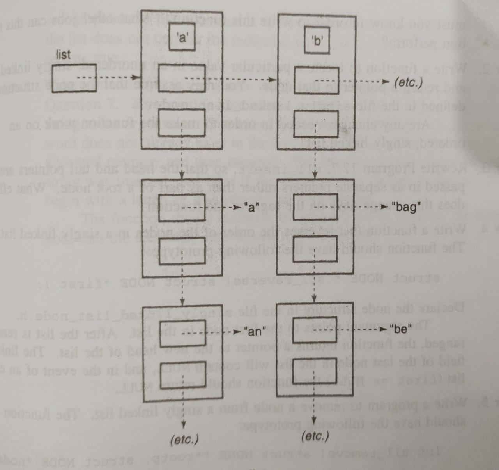

## Concordance List with Single and Double Linked List

A concordance list is a list which contains words in alphabetic order like a dictionary. Searching a word in a normal list can take much time as the list grows. So linked lists can be used to make it quicker.<p>

- A double linked list is used as primary list which has 26 elements each containing a character. One pointer points to the next character while the other points to another linked list (singly).

- Each double linked node is connected to a single link list called the secondary list which contains the words starting with the character stored in the head.<p>



```c
#include <stdio.h>
#include <stdlib.h>
#include <string.h>

typedef struct WORD {
	struct WORD *next;
	char *data;
} Word;

typedef struct LIST{
	struct LIST *next;
	struct WORD *wordList;
	char data;
} List ;

List *initList(void);
int insertWord(List* root, char *word);
void printList(List* root);

int main()
{
	List *root;
	//int n,i,len;

	root = initList(); /* Initialises the list of characters for the word list */
	
/*	printf("Enter the number of words to insert : \n");
	scanf("%d",&n);

	printf("Enter the length of the word :\n");
	scanf("%d",&len);

	char *word = malloc((len+1)*sizeof(char));
	if(word == NULL){
		printf("Unable to allocate size for the word!\n");
		exit(EXIT_FAILURE);
	}
*/
	char *word1 = "bapple";
	char *word2 = "boy";
	char *word3 = "cat";
	char *word4 = "dog";
	char *word5 = "egg";
	char *word6 = "fish";
	char *word7 = "god";
	char *word8 = "ice";
	
	insertWord(root,word1);
	insertWord(root,word2);
	insertWord(root,word3);
	insertWord(root,word4);
	insertWord(root,word5);
	insertWord(root,word6);
	insertWord(root,word7);
	insertWord(root,word8);

	printList(root);

	exit(EXIT_SUCCESS);
}

List* initList()
{
	List* root = NULL;
	int i;
	char ch;

	for(i=0;i<26;i++){
		ch = (char)('z' - i);	
		List* temp = malloc(sizeof(List));
		if(temp == NULL){
			printf("Error in malloc\n");
			exit(EXIT_FAILURE);
		}
		
		temp->data = ch;
		temp->wordList = NULL;
		temp->next = root;
		root=temp;

	}

	return root;
}

int insertWord(List *root, char *word)
{
	char ch = word[0];

	Word* temp = malloc(sizeof(Word));
	if(temp == NULL){
		printf("Error in malloc\n");
		return -1;
	}

	while(root!=NULL){
		if(root->data == ch){
			break;
		}
		root = root->next;
	}

	Word** linkp = &root->wordList;
	Word* current = *linkp;

	while(current!=NULL && (strcmp(word,current->data)<0)){
		linkp = &current->next;
		current = *linkp;
	}

	temp->data = word;
	temp->next = current;
	*linkp = temp;
	
	return 1;
}

void printList(List* root)
{
	Word* head;
	while(root!=NULL){
		printf("%c\n",root->data);
		head = root->wordList;
		while(head!=NULL){
			printf("\t%s\n",head->data);
			head = head->next;
		}
		root = root->next;
	}
}

```
Source Code : [here](./concList.c)
